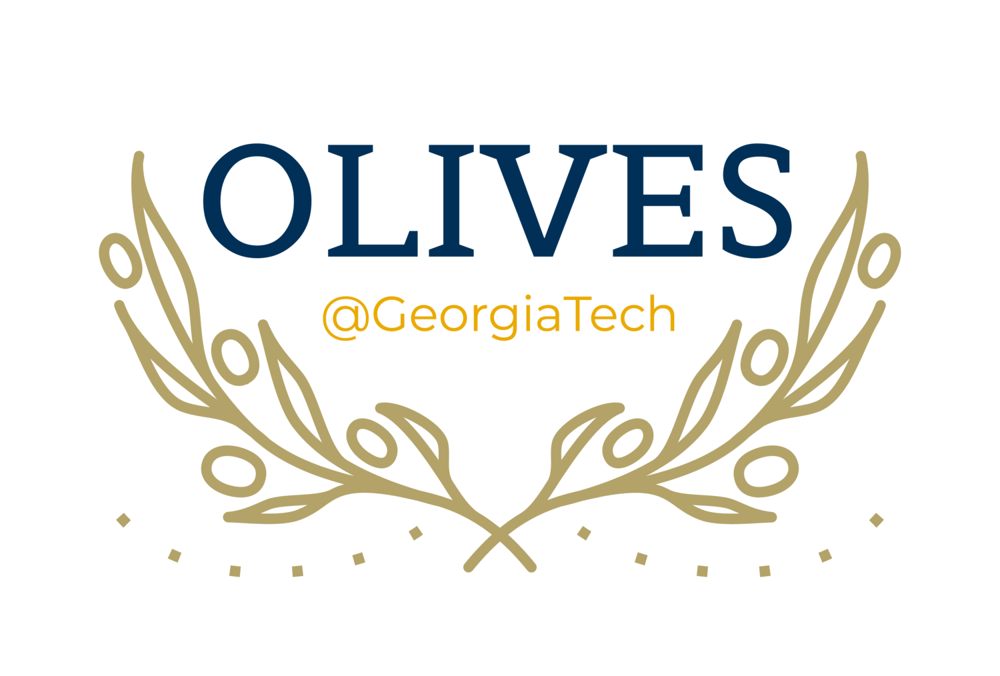

# Temporal Attentive Alignment for Video Domain Adaptation

[](https://paperswithcode.com/sota/domain-adaptation-on-hmdb-ucf-full?p=temporal-attentive-alignment-for-large-scale)
[](https://paperswithcode.com/sota/domain-adaptation-on-ucf-hmdb-full?p=temporal-attentive-alignment-for-large-scale)

---
[](https://ghassanalregib.info/)
This work was mainly done in the [**Omni Lab for Intelligent Visual Engineering and Science (OLIVES)**](https://ghassanalregib.info/) @ Georgia Tech. <br>
Feel free to check our lab's [**Website**](https://ghassanalregib.info/) and [**GitHub**](https://github.com/olivesgatech) for other interesting work!!!

---
This is the official PyTorch implementation of our papers:

**Temporal Attentive Alignment for Large-Scale Video Domain Adaptation**  
[__***Min-Hung Chen***__](https://www.linkedin.com/in/chensteven), [Zsolt Kira](https://www.cc.gatech.edu/~zk15/), [Ghassan AlRegib (Advisor)](https://ghassanalregib.info/), [Jaekwon Yoo](https://www.linkedin.com/in/jaekwon-yoo-8685862b/), [Ruxin Chen](https://www.linkedin.com/in/ruxin-chen-991477119/), [Jian Zheng](https://www.linkedin.com/in/jian-zheng/)  
[International Conference on Computer Vision (ICCV), 2019](http://iccv2019.thecvf.com/) **[Oral (acceptance rate: 4.6%)]**  
[[arXiv](https://arxiv.org/abs/1907.12743)][[Oral](https://youtu.be/j9cDuzmpYP8)][[Poster](webpage/ICCV2019_Steve_TA3N_poster_v1_2.pdf)][[Open Access](http://openaccess.thecvf.com/content_ICCV_2019/html/Chen_Temporal_Attentive_Alignment_for_Large-Scale_Video_Domain_Adaptation_ICCV_2019_paper.html)]

**Temporal Attentive Alignment for Video Domain Adaptation**  
[__***Min-Hung Chen***__](https://www.linkedin.com/in/chensteven), [Zsolt Kira](https://www.cc.gatech.edu/~zk15/), [Ghassan AlRegib (Advisor)](https://ghassanalregib.info/)  
[CVPR Workshop (Learning from Unlabeled Videos), 2019](https://sites.google.com/view/luv2019)  
[[arXiv](https://arxiv.org/abs/1905.10861)]

<p align="center">

</p>

Although various image-based domain adaptation (DA) techniques have been proposed in recent years, domain shift in videos is still not well-explored. Most previous
works only evaluate performance on small-scale datasets which are saturated. Therefore, we first propose two largescale video DA datasets with much larger domain discrepancy: **UCF-HMDB<sub>full</sub>** and **Kinetics-Gameplay**. Second, we investigate different DA integration methods for videos, and show that simultaneously aligning and learning temporal dynamics achieves effective alignment even without sophisticated DA methods. Finally, we propose **Temporal Attentive Adversarial Adaptation Network (TA<sup>3</sup>N)**, which explicitly attends to the temporal dynamics using domain
discrepancy for more effective domain alignment, achieving state-of-the-art performance on four video DA datasets.

<p align="center">


</p>

---
## Contents
* [Requirements](#requirements)
* [Dataset Preparation](#dataset-preparation)
  * [Data structure](#data-structure)
  * [File lists for training/validation](#file-lists-for-trainingvalidation)
  * [Input data](#input-data)
* [Usage](#usage)
  * [Training](#training)
  * [Testing](#testing)
<!--   * [Video Demo](#video-demo) -->
* [Options](#options)
  * [Domain Adaptation](#domain-adaptation)
  * [More options](#more-options)
* [Citation](#citation)
* [Contact](#contact)

---
## Requirements
* support Python 3.6, PyTorch 0.4, CUDA 9.0, CUDNN 7.1.4
* install all the library with: `pip install -r requirements.txt`

---
## Dataset Preparation
### Data structure
You need to extract frame-level features for each video to run the codes. To extract features, please check [`dataset_preparation/`](dataset_preparation/).

Folder Structure:
```
DATA_PATH/
  DATASET/
    list_DATASET_SUFFIX.txt
    RGB/
      CLASS_01/
        VIDEO_0001.mp4
        VIDEO_0002.mp4
        ...
      CLASS_02/
      ...

    RGB-Feature/
      VIDEO_0001/
        img_00001.t7
        img_00002.t7
        ...
      VIDEO_0002/
      ...
```
`RGB-Feature/` contains all the feature vectors for training/testing. `RGB/` contains all the raw videos.

There should be at least two `DATASET` folders: source training set  and validation set. If you want to do domain adaption, you need to have another `DATASET`: target training set.

### File lists for training/validation
The file list `list_DATASET_SUFFIX.txt` is required for data feeding. Each line in the list contains the full path of the video folder, video frame number, and video class index. It looks like:
```
DATA_PATH/DATASET/RGB-Feature/VIDEO_0001/ 100 0
DATA_PATH/DATASET/RGB-Feature/VIDEO_0002/ 150 1
......
```
To generate the file list, please check [`dataset_preparation/`](dataset_preparation/).

### Input data
Here we provide pre-extracted features and data list files, so you can skip the above two steps and directly try our training/testing codes. You may need to manually edit the path in the data list files.
* Features
  * UCF: [download](https://www.dropbox.com/s/swfdjp7i79uddpf/ucf101-feat.zip?dl=0)
  * HMDB: [download](https://www.dropbox.com/s/c3b3v9zecen4dwo/hmdb51-feat.zip?dl=0)
  * Olympic: [training](https://www.dropbox.com/s/ynqw0yrnuqjmhhs/olympic_train-feat.zip?dl=0) | [validation](https://www.dropbox.com/s/mxl888ca06tg8wn/olympic_val-feat.zip?dl=0)
* Data lists
  * UCF-Olympic
    * UCF: [training list](https://www.dropbox.com/s/ennjl2g0m44srj4/list_ucf101_train_ucf_olympic-feature.txt?dl=0) | [validation list](https://www.dropbox.com/s/hz8wzj0bo7dhdx4/list_ucf101_val_ucf_olympic-feature.txt?dl=0)
    * Olympic: [training list](https://www.dropbox.com/s/cvoc2j7vw8r60lb/list_olympic_train_ucf_olympic-feature.txt?dl=0) | [validation list](https://www.dropbox.com/s/3jrnx7kxbpqnwau/list_olympic_val_ucf_olympic-feature.txt?dl=0)
  * UCF-HMDB<sub>small</sub>
    * UCF: [training list](https://www.dropbox.com/s/zss3383x90jkmvk/list_ucf101_train_hmdb_ucf_small-feature.txt?dl=0) | [validation list](https://www.dropbox.com/s/buslj4fb03olztu/list_ucf101_val_hmdb_ucf_small-feature.txt?dl=0)
    * HMDB: [training list](https://www.dropbox.com/s/exxejp3ppzkww94/list_hmdb51_train_hmdb_ucf_small-feature.txt?dl=0) | [validation list](https://www.dropbox.com/s/2b15gjehcisk8sn/list_hmdb51_val_hmdb_ucf_small-feature.txt?dl=0)
  * UCF-HMDB<sub>full</sub>
    * UCF: [training list](https://www.dropbox.com/s/8dq8xcekdi18a04/list_ucf101_train_hmdb_ucf-feature.txt?dl=0) | [validation list](https://www.dropbox.com/s/wnd6e0z3u36x50w/list_ucf101_val_hmdb_ucf-feature.txt?dl=0)
    * HMDB: [training list](https://www.dropbox.com/s/4bl7kt0er3mib19/list_hmdb51_train_hmdb_ucf-feature.txt?dl=0) | [validation list](https://www.dropbox.com/s/zdg3of6z370i22w/list_hmdb51_val_hmdb_ucf-feature.txt?dl=0)

* Kinetics-Gameplay: please fill [**this form**](https://forms.gle/bziHhvQJGmi7hwF26) to request the features and data lists. <br>
<a rel="license" href="http://creativecommons.org/licenses/by-nc-sa/4.0/"></a>
The Kinetics-Gameplay dataset is licensed under <a rel="license" href="http://creativecommons.org/licenses/by-nc-sa/4.0/">CC BY-NC-SA 4.0</a> for non-commercial purposes only.
[](https://creativecommons.org/licenses/by-nc-sa/4.0/)

---
## Usage
* training/validation: Run `./script_train_val.sh`
<!-- * demo video: Run `./script_demo_video.sh` -->

All the commonly used variables/parameters have comments in the end of the line. Please check [Options](#options).

#### Training
All the outputs will be under the directory `exp_path`.
* Outputs:
  * model weights: `checkpoint.pth.tar`, `model_best.pth.tar`
  * log files: `train.log`, `train_short.log`, `val.log`, `val_short.log`

#### Testing
You can choose one of model_weights for testing. All the outputs will be under the directory `exp_path`.

* Outputs:
  * score_data: used to check the model output (`scores_XXX.npz`)
  * confusion matrix: `confusion_matrix_XXX.png` and `confusion_matrix_XXX-topK.txt`

<!-- #### Video Demo
`demo_video.py` overlays the predicted categories and confidence values on one video. Please see "Results". -->

---
## Options
#### Domain Adaptation
<!-- In both `./script_train_val.sh` and `./script_demo_video.sh`, there are several options related to our Domain Adaptation approaches. -->
In `./script_train_val.sh`, there are several options related to our DA approaches.
* `use_target`: switch on/off the DA mode
  * `none`: not use target data (no DA)
  * `uSv`/`Sv`: use target data in a unsupervised/supervised way

<!-- * options for the DA approaches:
  * discrepancy-based: DAN, JAN
  * adversarial-based: RevGrad
  * Normalization-based: AdaBN
  * Ensemble-based: MCD -->

#### More options
For more details of all the arguments, please check [opts.py](opts.py).

#### Notes
The options in the scripts have comments with the following types:
* no comment: user can still change it, but NOT recommend (may need to change the code or have different experimental results)
* comments with choices (e.g. `true | false`): can only choose from choices
* comments as `depend on users`: totally depend on users (mostly related to data path)

---
## Citation
If you find this repository useful, please cite our papers:
```
@article{chen2019taaan,
title={Temporal Attentive Alignment for Large-Scale Video Domain Adaptation},
author={Chen, Min-Hung and Kira, Zsolt and AlRegib, Ghassan and Yoo, Jaekwon and Chen, Ruxin and Zheng, Jian},
booktitle = {International Conference on Computer Vision (ICCV)},
year={2019},
url={https://arxiv.org/abs/1907.12743}
}

@article{chen2019temporal,
title={Temporal Attentive Alignment for Video Domain Adaptation},
author={Chen, Min-Hung and Kira, Zsolt and AlRegib, Ghassan},
booktitle = {CVPR Workshop on Learning from Unlabeled Videos},
year={2019},
url={https://arxiv.org/abs/1905.10861}
}
```

---
### Acknowledgments
This work was mainly done in [OLIVES](https://ghassanalregib.info/)@GT with the guidance of Prof. [Ghassan AlRegib](https://ghassanalregib.info/), and the collaboration with Prof. [Zsolt Kira](https://www.cc.gatech.edu/~zk15/) at Georgia Tech. Part of this work was done with the collaboration with [Jaekwon Yoo](https://www.linkedin.com/in/jaekwon-yoo-8685862b/), [Ruxin Chen](https://www.linkedin.com/in/ruxin-chen-991477119/) and [Jian Zheng](https://www.linkedin.com/in/jian-zheng/).
<!-- in [Sony Interactive Entertainment (SIE)](https://www.sie.com/en/index.html)  -->

Some codes are borrowed from [TSN](https://github.com/yjxiong/temporal-segment-networks), [pytorch-tsn](https://github.com/yjxiong/tsn-pytorch), [TRN-pytorch](https://github.com/metalbubble/TRN-pytorch), and [Xlearn](https://github.com/thuml/Xlearn/tree/master/pytorch).

Special thanks to the development team for the product used in the Kinetics-Gameplay dataset: <br>
**Detroit: Become Human™ ©Sony Interactive Entertainment Europe, developed by Quantic Dream**

---
### Contact
[Min-Hung Chen](https://www.linkedin.com/in/chensteven) <br>
cmhungsteve AT gatech DOT edu <br>
[](https://ghassanalregib.info/)
